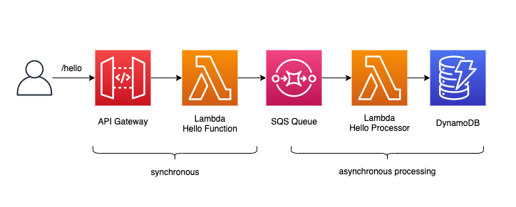
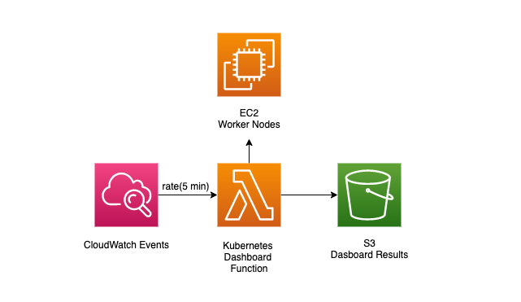

# awsdingler-serverless-api

SAM application that serves as backend for www.awsdingler.com. 

## Deploy a personal stack

Deployment config is found in `samconfig.toml`. This is to run `sam deploy` to create your own personal developer stack. Deployments to DEV and PROD are handled automatically by the pipeline. 

## Run function locally

Examples:

```
sam local invoke KubernetesDashboard \
--event events/k8s.json \
--env-vars env.json
```

```
sam local invoke HelloWorldFunction \
--event events/hello.json \
--env-vars env.json
```

## Pipeline

Pipeline creation can be found under the pipeline/cdk folder. 

## Hello World

This is an overly complicated hello world function developed on purpose to demo different Lambda integrations. In this case, an HTTP GET request to `/hello` will invoke a lambda function that sends a hello world message to an SQS queue, for which another lambda function processes the message asynchronously and stores it on a DynamoDB table. 



## Kubernetes Dashboard

There is a Lambda function that generates the data for this dashboard: https://www.awsdingler.com/kube. It gets triggered every 5 minutes by CloudWatch Events and it pings the Auto Scaling Group of the k8s worker nodes to get information about them and generate the data needed for the dashboard which is written to S3 in a `results.json` file. The ReactJS app pulls this json file and renders the dashboard.

